<style>
img {
  display: block;
  margin-left: auto;
  margin-right: auto;
}
</style>

<a id="top"></a>
# DevFest Data Science Track
*Build a weather model using Python.*

Written and developed by [CDSS](http://cdssatcu.com) in partnership with [ADI](http://adicu.com).


<a href="#top" class="top" id="getting-started">Top</a>
# About This Document

## Methodology
Welcome to the data science track. This guide will teach you fundamental concepts of data science by guiding you through the steps to obtain, analyze, and visualize data. We'll be exploring some weather data to see if we can predict whether it'll rain, so let's get started!

## Prerequisites
Basic knowledge of the Python programming language is suggested. If you don't already know Python, check out [this ADI-developed tutorial](http://learn.adicu.com/python/).

<a href="#top" class="top" id="table-of-contents">Top</a>
# Table of Contents
- [Level 0: Environment Setup](#level0)
- [Level 1: Scraping Data](#level1)
- [Level 2: Exploring Data](#level2)
- [Level 3: Introduction to Modeling](#level3)
- [Level 4: Advanced Modeling](#level4)
- [Level 5: Interactive Visualizations](#level5)

------------------------------

<a href="#top" class="top" id="level0">Top</a>
# Level 0: Environment Setup

## Using Conda

We highly recommend that you download and use
[Conda](https://www.continuum.io/downloads), an open-source package
manager for scientific computing. Why? Well, scientific computing
packages typically link to some heavy-duty C and Fortran libraries.
Conda makes it extremely easy to install these cross-language
dependencies easily on all major platforms. If you don't use Conda,
you might have to spend time messing around with installing an entire
Fortran toolchain, which is definitely not fun (especially on Windows).

The easiest way to install Conda is with Anaconda (make sure you pick
Python 3), which is essentially Conda bundled with two dozen commonly
installed dependencies. Anaconda comes with
[Spyder](https://en.wikipedia.org/wiki/Spyder_%28software%29) a nice IDE
for Python data science.  You can also use a [Jupyter
notebook](http://jupyter.org/), which lets you code in the browser (this
curriculum was originally developed on a Jupyter notebook, and we do
make use of a couple Jupyter-specific commands).

Be warned, though: Anaconda installs a _lot_ of packages.  If you're
strapped for hard drive space, consider installing
[Miniconda](http://conda.pydata.org/miniconda.html), the minimal
distribution with Conda.
After installing Conda, open up a command prompt (`cmd.exe` for Windows
and `Terminal` for Mac) and type:

```bash
$ conda update conda
$ conda install bokeh matplotlib notebook numpy pandas requests scikit-learn seaborn
```
<br>


For Conda power users, you also use the following `environment.yml` file:

```

name: devfest
dependencies:
- beautifulsoup4=4.4
- matplotlib=1.5.1
- notebook=4.1.0
- numpy=1.10.2
- pandas=0.17.1
- python=3.5
- requests=2.9.1
- seaborn=0.7.0
```
<br>


## Without Conda

If you're not using Conda, then we recommend you install Python 3 from
the [Python website](https://www.python.org/). Certain computers may
come with a version of Python installed: if you see something like:

```bash
$ python3
Python 3.5.1 (default, Dec  7 2015, 11:16:01)
[GCC 4.8.4] on linux
Type "help", "copyright", "credits" or "license" for more information.
>>>
```
<br>


when you type `python3` onto a terminal, then you're good to go (don't
worry too much if you have Python 3.3 or Python 3.4 instead of Python
3.5 -- our code should be compatible with all three versions).

Python 3 should automatically come with `pip`, the Python package
manager. Open up a terminal and type:

```bash
$ pip3 install BeautifulSoup4
$ pip3 install bokeh
$ pip3 install ipython
$ pip3 install jupyter
$ pip3 install matplotlib
$ pip3 install numpy
$ pip3 install pandas
$ pip3 install requests
$ pip3 install scikit-learn
$ pip3 install scipy
$ pip3 install seaborn
```
<br>


On Windows, you might need to visit [Christoph Gohlke's Unofficial
Windows Binaries](http://www.lfd.uci.edu/~gohlke/pythonlibs/) to get
things to install correctly.

## Getting Started

Open a terminal (or `cmd.exe`) and run:

```bash
$ jupyter notebook
```
If that doesn't work, try:

```bash
$ ipython notebook
```
<br>

a Jupyter notebook window should pop-up. Just create a new Python 3 notebook and you should be good to go.

If you decide to use something other than a Jupyter notebook, note that we used some Jupyter-specific We wrote this curriculum using [Jupyter notebooks](http://jupyter.org/), so there may be some slight finnegaling required (such as omitting `%matplotlib inline` and `bokeh.io.output_notebook()`).

<a href="#top" class="top" id="level1">Top</a>
# Level 1: Scraping Data

(Find this notebook hosted [here](http://nbviewer.jupyter.org/github/kl2806/devfest-data-science-track/blob/master/level_1.ipynb).)

In this level, we'll obtain the data we need for future analysis. Data collection is often overlooked, but it's crucial to obtain high quality data without errors.

Data comes in many different forms and from many different sources. For example, you might imagine collecting the most recent posts someone has made on Facebook. Each post would be a *data point* with multiple different *variables* (e.g. the time of the post, or the number of words in the post).

For this project, we'll be analyzing data from the [Weather Underground](http://www.wunderground.com/), a website for weather information.

So, how should we get our data? Well, one way would be to visit the website and copy-paste things into a spreadsheet. But, as you'd imagine, that gets very tedious very quickly. Why not make the computer do it for us?

Using a computer to automatically collect data from websites is called **web scraping**. Certain websites have things called **APIs** which are essentially pages specifically for computers extracting information, but there's still a lot of data locked-up without any APIs.

The Weather Underground actually has an API [available](http://www.wunderground.com/weather/api/), but we'll do it the hard way to show you how web scraping would work in the first place.

To start collecting our data, let's look at a [sample webpage](http://www.wunderground.com/history/airport/KNYC/2016/1/1/DailyHistory.html) that we may extract information from:

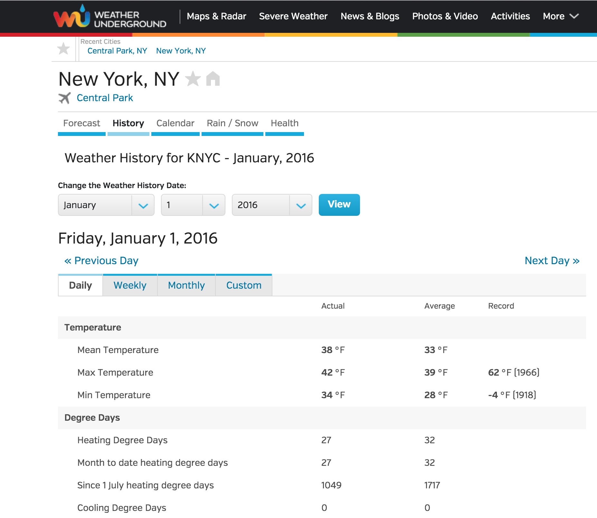

The page organizes information into a nice, neat table, which is good for us. Let's dig into this a little more by exploring how the webpage is presenting this information.

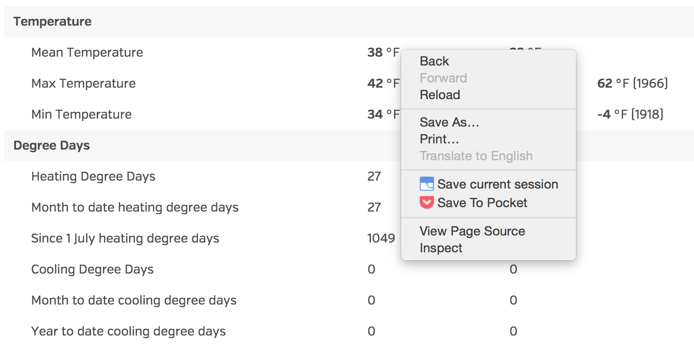

Let's right click on the 38°, and then press "Inspect". This will allow us to look at the actual HTML code that generated the webpage we're looking at. We can then right click where it says `tbody` and press "Edit as HTML".

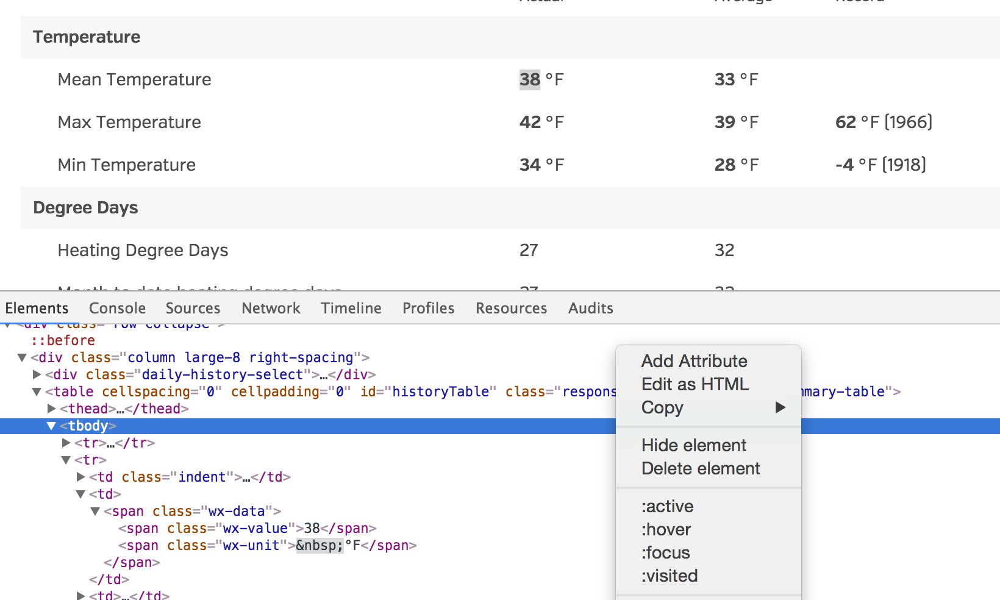

This should show you the code of this table, which should look like:

```html
<tbody>
		<tr>
		<td class="history-table-grey-header">Temperature</td>
		<td colspan="3" class="history-table-grey-header">&nbsp;</td>
		</tr>
		<tr>
		<td class="indent"><span>Mean Temperature</span></td>
		<td>
  <span class="wx-data"><span class="wx-value">38</span><span class="wx-unit">&nbsp;°F</span></span>
</td>
		<td>
  <span class="wx-data"><span class="wx-value">33</span><span class="wx-unit">&nbsp;°F</span></span>
</td>
		<td>&nbsp;</td>
		</tr>
		<tr>
		<td class="indent"><span>Max Temperature</span></td>
		<td>
  <span class="wx-data"><span class="wx-value">42</span><span class="wx-unit">&nbsp;°F</span></span>
</td>
		<td>
  <span class="wx-data"><span class="wx-value">39</span><span class="wx-unit">&nbsp;°F</span></span>
</td>
		<td>
  <span class="wx-data"><span class="wx-value">62</span><span class="wx-unit">&nbsp;°F</span></span>
(1966)</td>
		</tr>
```
<br>


Here, we're seeing the raw HTML that the website is amde up of. Although it might take some squinting, we can see that each `tr` (table row) represents one variable that we might be interested in.

Now, how much data do we want? To conveniently side-step leap years, let's say we're interested in data between January 1, 2013 and December 31, 2015.

Now, let's think more about what scope of data we want; we probably want at least a couple of years' worth of data. Let's say that we're interested in data between January 1, 2013 and December 31, 2015. Another nice thing about the Weather Underground is the URL structure: the URL for the page above is "http://www.wunderground.com/history/airport/KNYC/2016/1/1/DailyHistory.html" for January 1<sup>st</sup>, 2016. Luckily, it turns out that we can replace the `2016/1/1` with the year, month, and day that we're interested to obtain the right webpage. That means we can start by generating all the URLs we're interested with Python:


```python
days_per_month = {1: 31, 2: 28, 3: 31, 4: 30,
                  5: 31, 6: 30, 7: 31, 8: 31,
                  9: 30, 10: 31, 11: 30, 12: 31}

link_format = "http://www.wunderground.com/history/airport/KNYC/{}/{}/{}/DailyHistory.html"
links = [link_format.format(year, month, day)
         for year in range(2013, 2016) # 2013 - 2015 inclusive
         for month in range(1, 13)     # 1 - 12 inclusive
         for day in range(1, days_per_month[month] + 1)]

print(len(links))
print("\n".join(links[:5]))
```
<br>


```
    1095
    http://www.wunderground.com/history/airport/KNYC/2013/1/1/DailyHistory.html
    http://www.wunderground.com/history/airport/KNYC/2013/1/2/DailyHistory.html
    http://www.wunderground.com/history/airport/KNYC/2013/1/3/DailyHistory.html
    http://www.wunderground.com/history/airport/KNYC/2013/1/4/DailyHistory.html
    http://www.wunderground.com/history/airport/KNYC/2013/1/5/DailyHistory.html
```

It looks like our code is working! We have exactly 3 year's worth of links (3 * 365 = 1095), which is a nice little sanity check. Now that we have all the links, we can start downloading the webpages using a neat library called `requests`.

We'll also save all the webpages locally, so that we don't have to keep re-downloading things if we need to redo our analysis. (Don't worry if the next block of code takes a little bit to run, it is downloading over 1000 files after all!)


```python
import requests
import os.path

def download_file(link, name):
    if os.path.isfile(name):
        return
    file = open(name, 'w')
    r = requests.get(link)
    file.write(r.text)
    file.close()
for i, link in enumerate(links):
    if i % 50 == 0:
        print("Done with %d.." % i)
    download_file(link, "%d.html" % i)
```
<br>


    Done with 0..
    Done with 50..
    Done with 100..
    Done with 150..
    Done with 200..
    Done with 250..
    Done with 300..
    Done with 350..
    Done with 400..
    Done with 450..
    Done with 500..
    Done with 550..
    Done with 600..
    Done with 650..
    Done with 700..
    Done with 750..
    Done with 800..
    Done with 850..
    Done with 900..
    Done with 950..
    Done with 1000..
    Done with 1050..


Now, we can use a library called Beautiful Soup to parse and explore the HTML pages:


```python
from bs4 import BeautifulSoup

with open("0.html") as fin:
    soup = BeautifulSoup(fin.read(), "html.parser")
```
<br>


Using Beautiful Soup, we can look for particular things on different pages. For example, we can look for the links (`a` tags) on the page.


```python
all_as = soup.find_all('a')
for i in range(5):
    print(all_as[-i])
    print()
```
<br>


    <a href="https://www.wunderground.com/member/registration">
    <i class="fi-torso sidebar-icon"></i> Sign Up / Sign In
      </a>
    
    <a href="/wutv/?cm_ven=wutv_toast">
    <iframe class="underlay" frameborder="no" id="ustream-tdu-player" src="//www.ustream.tv/embed/21416049" width="240"></iframe>
    </a>
    
    <a class="modal-close close">×</a>
    
    <a aria-label="Close" class="close-reveal-modal">×</a>
    
    <a class="button medium radius" href="/member/registration">Remove Ads</a>
    


For the specific data we're looking for, it's all inside of a `table` with `historyTable` as the id. We can also search by id with BeautifulSoup.


```python
main_table = soup.find(id='historyTable')
```
<br>


Now we can look for `tr`'s within this table specifically.


```python
rows = main_table.find_all('tr')
print(len(rows))
for i in range(3):
    print(rows[i])
    print()
```
<br>


    34
    <tr>
    <th> </th>
    <th>Actual</th>
    <th>Average </th>
    <th>Record </th>
    </tr>
    
    <tr>
    <td class="history-table-grey-header">Temperature</td>
    <td class="history-table-grey-header" colspan="3"> </td>
    </tr>
    
    <tr>
    <td class="indent"><span>Mean Temperature</span></td>
    <td>
    <span class="wx-data"><span class="wx-value">33</span><span class="wx-unit"> °F</span></span>
    </td>
    <td>
    <span class="wx-data"><span class="wx-value">33</span><span class="wx-unit"> °F</span></span>
    </td>
    <td> </td>
    </tr>
    


Once we have an actual row, there's lots of information we can extract. Let's try it with one of the rows.

(We're only interested in the first two cells because those are the row name and value on that day.)


```python
row = rows[2]
for cell in row.find_all('td'):
    print(cell)
    print()
row_name = row.find_all('td')[0].text.strip()  # Get rid of extra whitespace
row_value = row.find_all('td')[1].text.strip()
print(row_name, ":", row_value)
```
<br>


    <td class="indent"><span>Mean Temperature</span></td>
    
    <td>
    <span class="wx-data"><span class="wx-value">33</span><span class="wx-unit"> °F</span></span>
    </td>
    
    <td>
    <span class="wx-data"><span class="wx-value">33</span><span class="wx-unit"> °F</span></span>
    </td>
    
    <td> </td>
    
    Mean Temperature : 33 °F


Wonderful! Let's write some code that can do this for all of the rows in the table we had above. 


```python
for row in rows:
    #Only process the rows with 4 cells to eliminate heading rows, etc.
    if len(row.find_all('td')) == 4:
        row_name = row.find_all('td')[0].text.strip()
        row_value = row.find_all('td')[1].text.strip() 
        print(row_name, ":", row_value)    
```
<br>


    Mean Temperature : 33 °F
    Max Temperature : 40 °F
    Min Temperature : 26 °F
    Heating Degree Days : 32
    Month to date heating degree days : 32
    Since 1 July heating degree days : 1622
    Cooling Degree Days : 0
    Month to date cooling degree days : 0
    Year to date cooling degree days : 0
    Dew Point : 22 °F
    Average Humidity : 54
    Maximum Humidity : 64
    Minimum Humidity : 44
    Precipitation : 0.00 in
    Month to date precipitation : 0.00
    Year to date precipitation : 0.00
    Snow : 0.00 in
    Month to date snowfall : 0.0
    Since 1 July snowfall : 5.1
    Snow Depth : 0.00 in
    Sea Level Pressure : 29.90 in
    Wind Speed : 7 mph
     (WNW)
    Max Wind Speed : 15 mph
    Max Gust Speed : 26 mph
    Visibility : 10 miles
    Events : 


Whoa! We now have tangible data for January 1<sup>st</sup>. To make things simpler, let's use the 'Mean Temperature', 'Max Temperature', 'Min Temperature', 'Dew Point', 'Average Humidity', 'Maximum Humidity', 'Minimum Humidity', 'Precipitation', 'Wind Speed', 'Max Wind Speed', and 'Max Gust Speed' variables (also known as fields) from here out. Let's write a function that can scrape one HTML file given its name.


```python
fields = ['Mean Temperature', 'Max Temperature', 'Min Temperature',\
          'Dew Point', 'Average Humidity', 'Maximum Humidity',\
          'Minimum Humidity', 'Precipitation', 'Wind Speed',\
          'Max Wind Speed', 'Max Gust Speed']
def scrape_file(name):
    with open(name) as fin:
        soup = BeautifulSoup(fin.read(), "html.parser")
    data = {}
    for row in soup.find(id="historyTable").find_all("tr"):
        cells = row.find_all("td")
        if len(cells) == 4:
            name = cells[0].text.strip()
            if name in fields:
                data[name] = cells[1].text.split()[0].strip()   # Split to remove units
    return data
scrape_file("0.html")
```
<br>


    {'Average Humidity': '54',
     'Dew Point': '22',
     'Max Gust Speed': '26',
     'Max Temperature': '40',
     'Max Wind Speed': '15',
     'Maximum Humidity': '64',
     'Mean Temperature': '33',
     'Min Temperature': '26',
     'Minimum Humidity': '44',
     'Precipitation': '0.00',
     'Wind Speed': '7'}


Woo, we're making progress! Now that we can extract the data we want from any general HTML, it isn't too much more work to put together all of the data. We'll be storing all of this data in a special type of file called a *Comma Separated Values* (CSV) file; this just means a file that looks something like this:

```
<br>

A,B,C
1,2,3
5,10,15
```
<br>


It is essentially equivalent to a spreadsheet that is like this:

|  A  |  B  |  C  |
| :-: | :-: | :-: |
|  1  |  2  |  3  |
|  5  | 10  | 15  |

The useful thing about CSV files is that it is an extremely common data format that data science tools utilize. So common, in fact, that Python has a builtin tools to write them. Let's get started on writing out our CSV file!


```python
import csv

csv_fields = ["Month", "Day", "Year"] + fields

with open("weather_data.csv", "w") as fout:
    writer = csv.DictWriter(fout, csv_fields)
    writer.writeheader()
    
    for i, link in enumerate(links):
        data = scrape_file("{}.html".format(i))
        url_parts = link.split("/")
        data["Month"] = int(url_parts[-3])
        data["Year"] = int(url_parts[-4])
        data["Day"] = int(url_parts[-2])
        
        writer.writerow(data)
```
<br>


<a href="#top" class="top" id="level2">Top</a>
# Level 2: Exploring Data

(Find this notebook hosted [here](http://nbviewer.jupyter.org/github/kl2806/devfest-data-science-track/blob/master/level_2.ipynb).)

Before continuing on with level 2, make sure you've generated the `weather_data.csv` file we generated from level 1. This contains weather data from 2013 to 2015, and we'll be exploring that data within this level.

We'll now continue our data project by exploring the treasure trove of data we collected in level 1. This is also an overlooked but important part of data science; it helps us catch errors that may not have come up in the process of obtaining the data. Additionally, it gives us some intuition for the data, which is helpful when it comes to modeling.

`Pandas` is the workhorse of Python data analysis. Let's use it to slurp up our data in one shot:


```python
import pandas as pd

data = pd.read_csv('weather_data.csv')
```
<br>


The basic object that Pandas uses is called a "data frame". You can think of it essentially as a spreadsheet or a two-dimensional array. Each row of the spreadsheet is another data point, while each column is a variable.


```python
pd.options.display.max_rows = 7
data
```
<br>


<div>
<table border="1" class="dataframe">
  <thead>
    <tr style="text-align: right;">
      <th></th>
      <th>Month</th>
      <th>Day</th>
      <th>Year</th>
      <th>Mean Temperature</th>
      <th>Max Temperature</th>
      <th>Min Temperature</th>
      <th>Dew Point</th>
      <th>Average Humidity</th>
      <th>Maximum Humidity</th>
      <th>Minimum Humidity</th>
      <th>Precipitation</th>
      <th>Wind Speed</th>
      <th>Max Wind Speed</th>
      <th>Max Gust Speed</th>
    </tr>
  </thead>
  <tbody>
    <tr>
      <th>0</th>
      <td>1</td>
      <td>1</td>
      <td>2013</td>
      <td>33</td>
      <td>40</td>
      <td>26</td>
      <td>22</td>
      <td>54</td>
      <td>64</td>
      <td>44</td>
      <td>0.00</td>
      <td>7</td>
      <td>15</td>
      <td>26</td>
    </tr>
    <tr>
      <th>1</th>
      <td>1</td>
      <td>2</td>
      <td>2013</td>
      <td>28</td>
      <td>33</td>
      <td>22</td>
      <td>11</td>
      <td>48</td>
      <td>57</td>
      <td>39</td>
      <td>0.00</td>
      <td>6</td>
      <td>15</td>
      <td>22</td>
    </tr>
    <tr>
      <th>2</th>
      <td>1</td>
      <td>3</td>
      <td>2013</td>
      <td>28</td>
      <td>32</td>
      <td>24</td>
      <td>14</td>
      <td>56</td>
      <td>68</td>
      <td>43</td>
      <td>0.00</td>
      <td>5</td>
      <td>13</td>
      <td>20</td>
    </tr>
    <tr>
      <th>...</th>
      <td>...</td>
      <td>...</td>
      <td>...</td>
      <td>...</td>
      <td>...</td>
      <td>...</td>
      <td>...</td>
      <td>...</td>
      <td>...</td>
      <td>...</td>
      <td>...</td>
      <td>...</td>
      <td>...</td>
      <td>...</td>
    </tr>
    <tr>
      <th>1092</th>
      <td>12</td>
      <td>29</td>
      <td>2015</td>
      <td>40</td>
      <td>46</td>
      <td>34</td>
      <td>37</td>
      <td>87</td>
      <td>92</td>
      <td>82</td>
      <td>0.45</td>
      <td>7</td>
      <td>18</td>
      <td>24</td>
    </tr>
    <tr>
      <th>1093</th>
      <td>12</td>
      <td>30</td>
      <td>2015</td>
      <td>43</td>
      <td>48</td>
      <td>38</td>
      <td>39</td>
      <td>81</td>
      <td>86</td>
      <td>76</td>
      <td>0.19</td>
      <td>4</td>
      <td>9</td>
      <td>13</td>
    </tr>
    <tr>
      <th>1094</th>
      <td>12</td>
      <td>31</td>
      <td>2015</td>
      <td>45</td>
      <td>48</td>
      <td>42</td>
      <td>37</td>
      <td>71</td>
      <td>92</td>
      <td>49</td>
      <td>0.03</td>
      <td>5</td>
      <td>14</td>
      <td>20</td>
    </tr>
  </tbody>
</table>
<p>1095 rows × 14 columns</p>
</div>


Before going on, let's rename the columns to be lowercase and remove spaces. This is a standard practice to help remember the format of the column names (no more guessing whether it's "dew point" or "Dew point" or "Dew Point").


```python
data.columns = [name.lower().replace(" ", "_")
                for name in data.columns]
data
```
<br>


<div>
<table border="1" class="dataframe">
  <thead>
    <tr style="text-align: right;">
      <th></th>
      <th>month</th>
      <th>day</th>
      <th>year</th>
      <th>mean_temperature</th>
      <th>max_temperature</th>
      <th>min_temperature</th>
      <th>dew_point</th>
      <th>average_humidity</th>
      <th>maximum_humidity</th>
      <th>minimum_humidity</th>
      <th>precipitation</th>
      <th>wind_speed</th>
      <th>max_wind_speed</th>
      <th>max_gust_speed</th>
    </tr>
  </thead>
  <tbody>
    <tr>
      <th>0</th>
      <td>1</td>
      <td>1</td>
      <td>2013</td>
      <td>33</td>
      <td>40</td>
      <td>26</td>
      <td>22</td>
      <td>54</td>
      <td>64</td>
      <td>44</td>
      <td>0.00</td>
      <td>7</td>
      <td>15</td>
      <td>26</td>
    </tr>
    <tr>
      <th>1</th>
      <td>1</td>
      <td>2</td>
      <td>2013</td>
      <td>28</td>
      <td>33</td>
      <td>22</td>
      <td>11</td>
      <td>48</td>
      <td>57</td>
      <td>39</td>
      <td>0.00</td>
      <td>6</td>
      <td>15</td>
      <td>22</td>
    </tr>
    <tr>
      <th>2</th>
      <td>1</td>
      <td>3</td>
      <td>2013</td>
      <td>28</td>
      <td>32</td>
      <td>24</td>
      <td>14</td>
      <td>56</td>
      <td>68</td>
      <td>43</td>
      <td>0.00</td>
      <td>5</td>
      <td>13</td>
      <td>20</td>
    </tr>
    <tr>
      <th>...</th>
      <td>...</td>
      <td>...</td>
      <td>...</td>
      <td>...</td>
      <td>...</td>
      <td>...</td>
      <td>...</td>
      <td>...</td>
      <td>...</td>
      <td>...</td>
      <td>...</td>
      <td>...</td>
      <td>...</td>
      <td>...</td>
    </tr>
    <tr>
      <th>1092</th>
      <td>12</td>
      <td>29</td>
      <td>2015</td>
      <td>40</td>
      <td>46</td>
      <td>34</td>
      <td>37</td>
      <td>87</td>
      <td>92</td>
      <td>82</td>
      <td>0.45</td>
      <td>7</td>
      <td>18</td>
      <td>24</td>
    </tr>
    <tr>
      <th>1093</th>
      <td>12</td>
      <td>30</td>
      <td>2015</td>
      <td>43</td>
      <td>48</td>
      <td>38</td>
      <td>39</td>
      <td>81</td>
      <td>86</td>
      <td>76</td>
      <td>0.19</td>
      <td>4</td>
      <td>9</td>
      <td>13</td>
    </tr>
    <tr>
      <th>1094</th>
      <td>12</td>
      <td>31</td>
      <td>2015</td>
      <td>45</td>
      <td>48</td>
      <td>42</td>
      <td>37</td>
      <td>71</td>
      <td>92</td>
      <td>49</td>
      <td>0.03</td>
      <td>5</td>
      <td>14</td>
      <td>20</td>
    </tr>
  </tbody>
</table>
<p>1095 rows × 14 columns</p>
</div>


Data frames are kind of like dictionaries, where the keys are column names and the values is `Series` of data.


```python
data["dew_point"]
```
<br>


    0       22
    1       11
    2       14
            ..
    1092    37
    1093    39
    1094    37
    Name: dew_point, dtype: int64


These series work just like numpy arrays, supporting all the standard arithmetic and reductions operators:


```python
print(data["dew_point"].mean())
data["dew_point"] * 5
```
<br>


    40.2630136986


    0       110
    1        55
    2        70
           ... 
    1092    185
    1093    195
    1094    185
    Name: dew_point, dtype: int64


**Unlike** a dictionary, though, the `len` of a data frame is not the number of "keys" (columns). To get that, you need to do:


```python
print(len(data))
print(len(data.columns))
data.columns
```
<br>


    1095
    14


    Index(['month', 'day', 'year', 'mean_temperature', 'max_temperature',
           'min_temperature', 'dew_point', 'average_humidity', 'maximum_humidity',
           'minimum_humidity', 'precipitation', 'wind_speed', 'max_wind_speed',
           'max_gust_speed'],
          dtype='object')


You can also get both dimensions at once using `.shape`:


```python
data.shape
```
<br>


    (1095, 14)


You can also get rows of the data frame using the `.iloc` selector. There, the `.iloc` works like a list:


```python
data.iloc[0]
```
<br>


    month                1
    day                  1
    year              2013
                      ... 
    wind_speed           7
    max_wind_speed      15
    max_gust_speed      26
    Name: 0, dtype: object


<br>

```python
data.iloc[:5]
```
<br>


<div>
<table border="1" class="dataframe">
  <thead>
    <tr style="text-align: right;">
      <th></th>
      <th>month</th>
      <th>day</th>
      <th>year</th>
      <th>mean_temperature</th>
      <th>max_temperature</th>
      <th>min_temperature</th>
      <th>dew_point</th>
      <th>average_humidity</th>
      <th>maximum_humidity</th>
      <th>minimum_humidity</th>
      <th>precipitation</th>
      <th>wind_speed</th>
      <th>max_wind_speed</th>
      <th>max_gust_speed</th>
    </tr>
  </thead>
  <tbody>
    <tr>
      <th>0</th>
      <td>1</td>
      <td>1</td>
      <td>2013</td>
      <td>33</td>
      <td>40</td>
      <td>26</td>
      <td>22</td>
      <td>54</td>
      <td>64</td>
      <td>44</td>
      <td>0.00</td>
      <td>7</td>
      <td>15</td>
      <td>26</td>
    </tr>
    <tr>
      <th>1</th>
      <td>1</td>
      <td>2</td>
      <td>2013</td>
      <td>28</td>
      <td>33</td>
      <td>22</td>
      <td>11</td>
      <td>48</td>
      <td>57</td>
      <td>39</td>
      <td>0.00</td>
      <td>6</td>
      <td>15</td>
      <td>22</td>
    </tr>
    <tr>
      <th>2</th>
      <td>1</td>
      <td>3</td>
      <td>2013</td>
      <td>28</td>
      <td>32</td>
      <td>24</td>
      <td>14</td>
      <td>56</td>
      <td>68</td>
      <td>43</td>
      <td>0.00</td>
      <td>5</td>
      <td>13</td>
      <td>20</td>
    </tr>
    <tr>
      <th>3</th>
      <td>1</td>
      <td>4</td>
      <td>2013</td>
      <td>34</td>
      <td>37</td>
      <td>30</td>
      <td>19</td>
      <td>56</td>
      <td>63</td>
      <td>48</td>
      <td>0.00</td>
      <td>8</td>
      <td>18</td>
      <td>28</td>
    </tr>
    <tr>
      <th>4</th>
      <td>1</td>
      <td>5</td>
      <td>2013</td>
      <td>37</td>
      <td>42</td>
      <td>32</td>
      <td>19</td>
      <td>48</td>
      <td>56</td>
      <td>39</td>
      <td>0.00</td>
      <td>7</td>
      <td>17</td>
      <td>26</td>
    </tr>
  </tbody>
</table>
</div>


Great, we can now access whole regions of data using the appropriate syntax depending on whether we want rows or column. Let's now try programatically looking for subsets of the data. For example, say we only wanted the data that was recorded in the month of December.


```python
december_data = data[data.month == 12]
december_data[:5]
```
<br>


<div>
<table border="1" class="dataframe">
  <thead>
    <tr style="text-align: right;">
      <th></th>
      <th>month</th>
      <th>day</th>
      <th>year</th>
      <th>mean_temperature</th>
      <th>max_temperature</th>
      <th>min_temperature</th>
      <th>dew_point</th>
      <th>average_humidity</th>
      <th>maximum_humidity</th>
      <th>minimum_humidity</th>
      <th>precipitation</th>
      <th>wind_speed</th>
      <th>max_wind_speed</th>
      <th>max_gust_speed</th>
    </tr>
  </thead>
  <tbody>
    <tr>
      <th>334</th>
      <td>12</td>
      <td>1</td>
      <td>2013</td>
      <td>43</td>
      <td>49</td>
      <td>36</td>
      <td>29</td>
      <td>61</td>
      <td>76</td>
      <td>46</td>
      <td>0.00</td>
      <td>2</td>
      <td>7</td>
      <td>10</td>
    </tr>
    <tr>
      <th>335</th>
      <td>12</td>
      <td>2</td>
      <td>2013</td>
      <td>45</td>
      <td>49</td>
      <td>41</td>
      <td>34</td>
      <td>68</td>
      <td>82</td>
      <td>53</td>
      <td>0.00</td>
      <td>3</td>
      <td>8</td>
      <td>11</td>
    </tr>
    <tr>
      <th>336</th>
      <td>12</td>
      <td>3</td>
      <td>2013</td>
      <td>46</td>
      <td>53</td>
      <td>38</td>
      <td>34</td>
      <td>66</td>
      <td>86</td>
      <td>46</td>
      <td>0.00</td>
      <td>3</td>
      <td>8</td>
      <td>12</td>
    </tr>
    <tr>
      <th>337</th>
      <td>12</td>
      <td>4</td>
      <td>2013</td>
      <td>47</td>
      <td>52</td>
      <td>41</td>
      <td>36</td>
      <td>64</td>
      <td>73</td>
      <td>54</td>
      <td>0.00</td>
      <td>3</td>
      <td>8</td>
      <td>12</td>
    </tr>
    <tr>
      <th>338</th>
      <td>12</td>
      <td>5</td>
      <td>2013</td>
      <td>54</td>
      <td>60</td>
      <td>48</td>
      <td>50</td>
      <td>83</td>
      <td>93</td>
      <td>72</td>
      <td>0.01</td>
      <td>2</td>
      <td>9</td>
      <td>17</td>
    </tr>
  </tbody>
</table>
</div>


We can chain these conditions to ensure that multiple conditions are met. Let's try extracting data from May 2015.


```python
may_2015_data = data[(data.month == 5) & (data.year == 2015)]
may_2015_data[:5]
```
<br>


<div>
<table border="1" class="dataframe">
  <thead>
    <tr style="text-align: right;">
      <th></th>
      <th>month</th>
      <th>day</th>
      <th>year</th>
      <th>mean_temperature</th>
      <th>max_temperature</th>
      <th>min_temperature</th>
      <th>dew_point</th>
      <th>average_humidity</th>
      <th>maximum_humidity</th>
      <th>minimum_humidity</th>
      <th>precipitation</th>
      <th>wind_speed</th>
      <th>max_wind_speed</th>
      <th>max_gust_speed</th>
    </tr>
  </thead>
  <tbody>
    <tr>
      <th>850</th>
      <td>5</td>
      <td>1</td>
      <td>2015</td>
      <td>56</td>
      <td>63</td>
      <td>49</td>
      <td>39</td>
      <td>59</td>
      <td>71</td>
      <td>46</td>
      <td>0.00</td>
      <td>5</td>
      <td>14</td>
      <td>18</td>
    </tr>
    <tr>
      <th>851</th>
      <td>5</td>
      <td>2</td>
      <td>2015</td>
      <td>61</td>
      <td>74</td>
      <td>48</td>
      <td>40</td>
      <td>56</td>
      <td>80</td>
      <td>31</td>
      <td>0.00</td>
      <td>3</td>
      <td>15</td>
      <td>22</td>
    </tr>
    <tr>
      <th>852</th>
      <td>5</td>
      <td>3</td>
      <td>2015</td>
      <td>66</td>
      <td>80</td>
      <td>51</td>
      <td>38</td>
      <td>41</td>
      <td>59</td>
      <td>22</td>
      <td>0.00</td>
      <td>3</td>
      <td>10</td>
      <td>18</td>
    </tr>
    <tr>
      <th>853</th>
      <td>5</td>
      <td>4</td>
      <td>2015</td>
      <td>71</td>
      <td>85</td>
      <td>57</td>
      <td>44</td>
      <td>47</td>
      <td>72</td>
      <td>22</td>
      <td>0.00</td>
      <td>5</td>
      <td>15</td>
      <td>23</td>
    </tr>
    <tr>
      <th>854</th>
      <td>5</td>
      <td>5</td>
      <td>2015</td>
      <td>76</td>
      <td>85</td>
      <td>66</td>
      <td>50</td>
      <td>44</td>
      <td>53</td>
      <td>34</td>
      <td>0.00</td>
      <td>4</td>
      <td>13</td>
      <td>21</td>
    </tr>
  </tbody>
</table>
</div>


Now that we know how to explore the data, let's look at some techniques for summarizing the data in different columns. First up is the `dtypes` attribute.


```python
data.dtypes
```
<br>


    month              int64
    day                int64
    year               int64
                       ...  
    wind_speed        object
    max_wind_speed    object
    max_gust_speed    object
    dtype: object


This function seems simple because it just prints out the type of each column; however, it's useful if you spot something you don't expect. For example, we expect that `precipitation`, `wind_speed`, `max_wind_speed`, and `max_gust_speed` are all numeric types, but they are currently `object` types. Let's see if we can figure out what's going on. The `unique` function will show us all of the unique values of a particular column.


```python
data.precipitation.unique()
```
<br>


    array(['0.00', 'T', '0.55', '0.02', '0.09', '0.12', '0.69', '0.07', '0.22',
           '0.06', '0.04', '0.90', '1.15', '0.38', '0.49', '0.03', '0.15',
           '0.26', '0.01', '0.14', '1.56', '0.19', '0.56', '0.79', '0.60',
           '0.36', '0.17', '0.08', '0.63', '0.05', '3.02', '0.50', '1.09',
           '1.81', '0.30', '0.52', '0.85', '0.87', '0.13', '4.16', '0.48',
           '1.38', '1.26', '0.24', '0.84', '0.53', '0.23', '0.25', '0.31',
           '0.65', '0.46', '0.43', '1.60', '0.72', '0.45', '0.51', '1.98',
           '0.73', '1.20', '0.33', '0.29', '0.11', '0.10', '1.17', '1.43',
           '1.78', '0.16', '0.35', '0.92', '0.21', '0.34', '0.71', '4.97',
           '0.41', '0.37', '1.54', '0.91', '0.40', '1.28', '0.96', '0.39',
           '1.30', '0.62', '0.32', '1.18', '1.11', '1.51', '0.61', '0.20',
           '0.70', '1.24', '1.22', '2.54', '0.80', '2.10', '1.02', '0.67',
           '0.76', '0.81', '0.27', '1.37', '1.46', '0.57', '0.64', '1.12',
           '0.42', '1.95', '1.58', '1.08', '0.89', '1.40', '1.25', '1.21',
           '1.55'], dtype=object)


It looks like we found the problem! While most of the values are things we'd expect for a numeric column, we also have an odd one out: `'T'`. We can automatically convert the whole data frame to be numeric types using the handy `convert_objects` function. 


```python
clean_data = data.convert_objects(convert_numeric=True)
print(clean_data.dtypes)
clean_data.precipitation.unique()
```
<br>


    month               int64
    day                 int64
    year                int64
                       ...   
    wind_speed        float64
    max_wind_speed    float64
    max_gust_speed    float64
    dtype: object


    array([ 0.  ,   nan,  0.55,  0.02,  0.09,  0.12,  0.69,  0.07,  0.22,
            0.06,  0.04,  0.9 ,  1.15,  0.38,  0.49,  0.03,  0.15,  0.26,
            0.01,  0.14,  1.56,  0.19,  0.56,  0.79,  0.6 ,  0.36,  0.17,
            0.08,  0.63,  0.05,  3.02,  0.5 ,  1.09,  1.81,  0.3 ,  0.52,
            0.85,  0.87,  0.13,  4.16,  0.48,  1.38,  1.26,  0.24,  0.84,
            0.53,  0.23,  0.25,  0.31,  0.65,  0.46,  0.43,  1.6 ,  0.72,
            0.45,  0.51,  1.98,  0.73,  1.2 ,  0.33,  0.29,  0.11,  0.1 ,
            1.17,  1.43,  1.78,  0.16,  0.35,  0.92,  0.21,  0.34,  0.71,
            4.97,  0.41,  0.37,  1.54,  0.91,  0.4 ,  1.28,  0.96,  0.39,
            1.3 ,  0.62,  0.32,  1.18,  1.11,  1.51,  0.61,  0.2 ,  0.7 ,
            1.24,  1.22,  2.54,  0.8 ,  2.1 ,  1.02,  0.67,  0.76,  0.81,
            0.27,  1.37,  1.46,  0.57,  0.64,  1.12,  0.42,  1.95,  1.58,
            1.08,  0.89,  1.4 ,  1.25,  1.21,  1.55])


Great, it looks like the conversion did what we expected to for the data types, but it introduced this weird value of `nan`. We can drop the rows containing NAs out of the data frame using the `dropna` function.


```python
clean_data = clean_data.dropna()
```
<br>


Awesome, now that we have cleaned up our data, let's try using the `describe` function to get a better idea of what's going on in the data.


```python
pd.options.display.max_rows = 999
clean_data.describe().transpose()
```
<br>


<div>
<table border="1" class="dataframe">
  <thead>
    <tr style="text-align: right;">
      <th></th>
      <th>count</th>
      <th>mean</th>
      <th>std</th>
      <th>min</th>
      <th>25%</th>
      <th>50%</th>
      <th>75%</th>
      <th>max</th>
    </tr>
  </thead>
  <tbody>
    <tr>
      <th>month</th>
      <td>1008</td>
      <td>6.583333</td>
      <td>3.420686</td>
      <td>1</td>
      <td>4</td>
      <td>7</td>
      <td>10.00</td>
      <td>12.00</td>
    </tr>
    <tr>
      <th>day</th>
      <td>1008</td>
      <td>15.585317</td>
      <td>8.798791</td>
      <td>1</td>
      <td>8</td>
      <td>15</td>
      <td>23.00</td>
      <td>31.00</td>
    </tr>
    <tr>
      <th>year</th>
      <td>1008</td>
      <td>2014.009921</td>
      <td>0.818056</td>
      <td>2013</td>
      <td>2013</td>
      <td>2014</td>
      <td>2015.00</td>
      <td>2015.00</td>
    </tr>
    <tr>
      <th>mean_temperature</th>
      <td>1008</td>
      <td>56.093254</td>
      <td>18.044831</td>
      <td>11</td>
      <td>42</td>
      <td>58</td>
      <td>72.00</td>
      <td>90.00</td>
    </tr>
    <tr>
      <th>max_temperature</th>
      <td>1008</td>
      <td>63.052579</td>
      <td>18.898837</td>
      <td>18</td>
      <td>47</td>
      <td>65</td>
      <td>80.00</td>
      <td>98.00</td>
    </tr>
    <tr>
      <th>min_temperature</th>
      <td>1008</td>
      <td>48.629960</td>
      <td>17.503609</td>
      <td>2</td>
      <td>35</td>
      <td>50</td>
      <td>64.00</td>
      <td>83.00</td>
    </tr>
    <tr>
      <th>dew_point</th>
      <td>1008</td>
      <td>40.452381</td>
      <td>19.303506</td>
      <td>-12</td>
      <td>26</td>
      <td>43</td>
      <td>56.00</td>
      <td>73.00</td>
    </tr>
    <tr>
      <th>average_humidity</th>
      <td>1008</td>
      <td>59.195437</td>
      <td>13.629751</td>
      <td>27</td>
      <td>49</td>
      <td>58</td>
      <td>69.00</td>
      <td>96.00</td>
    </tr>
    <tr>
      <th>maximum_humidity</th>
      <td>1008</td>
      <td>75.399802</td>
      <td>14.968550</td>
      <td>39</td>
      <td>64</td>
      <td>76</td>
      <td>89.00</td>
      <td>100.00</td>
    </tr>
    <tr>
      <th>minimum_humidity</th>
      <td>1008</td>
      <td>42.499008</td>
      <td>14.828714</td>
      <td>11</td>
      <td>32</td>
      <td>40</td>
      <td>51.00</td>
      <td>92.00</td>
    </tr>
    <tr>
      <th>precipitation</th>
      <td>1008</td>
      <td>0.138919</td>
      <td>0.388731</td>
      <td>0</td>
      <td>0</td>
      <td>0</td>
      <td>0.06</td>
      <td>4.97</td>
    </tr>
    <tr>
      <th>wind_speed</th>
      <td>1008</td>
      <td>5.489087</td>
      <td>3.746151</td>
      <td>1</td>
      <td>4</td>
      <td>5</td>
      <td>7.00</td>
      <td>99.00</td>
    </tr>
    <tr>
      <th>max_wind_speed</th>
      <td>1008</td>
      <td>14.020833</td>
      <td>4.582962</td>
      <td>7</td>
      <td>12</td>
      <td>14</td>
      <td>16.00</td>
      <td>99.00</td>
    </tr>
    <tr>
      <th>max_gust_speed</th>
      <td>1008</td>
      <td>22.403770</td>
      <td>6.630005</td>
      <td>10</td>
      <td>18</td>
      <td>22</td>
      <td>26.00</td>
      <td>99.00</td>
    </tr>
  </tbody>
</table>
</div>


(The `transpose` function just turns any data frame sideways; here, it was done for readability.)

The reason that `describe` is so cool is that we get summary statistics for every single column. Everything seems okay, so let's get started on plotting the data to see even more patterns.

We'll be using the matplotlib and Seaborn packages within Python to plot data. Matplotlib is the standard plotting package in Python, but it's honestly kind of a pain to actually use. Seaborn is a nice wrapper for statistical plotting, with a much easier interface. It also makes really pretty pictures!

To start, we'll need the following few lines:


```python
%matplotlib inline
import matplotlib.pyplot as plt
import seaborn as sns
import numpy as np
```
<br>


The `%matplotlib inline` is a special Jupyter magic. It only works on Jupyter clients (like the notebook or the IPython shell). It essentially just tells matplotlib to embed its graphs in the html of the notebook, instead of popping up in a new window.


```python
sns.distplot(clean_data.mean_temperature)
```
<br>


    <matplotlib.axes._subplots.AxesSubplot at 0x105659128>


This simple plot just visualizes the distribution of the average temperature across all the days we collected data for; specifically, it plots the histogram (the bars) and an estimate of the distribution (the line). We can also just plot the histogram.


```python
sns.distplot(clean_data.mean_temperature, kde=False)
```
<br>


    <matplotlib.axes._subplots.AxesSubplot at 0x107bd66d8>


Neat! Let's add a title and some axis labels.


```python
sns.distplot(clean_data.mean_temperature, kde=False)
sns.plt.title('Daily Average Temperature (2013 - 2015)')
sns.plt.xlabel('Temperature')
sns.plt.ylabel('Frequency')
```
<br>


    <matplotlib.text.Text at 0x107d3f630>


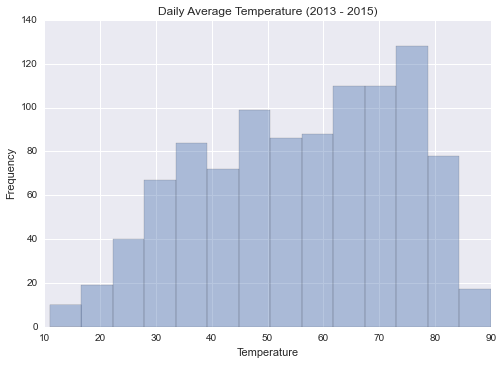


That looks like a pretty fancy graph. Let's zoom in on a portion by setting the limits of the plot; we'll also change the bin size accordingly since we're looking at a portion of the plot.


```python
sns.distplot(clean_data.mean_temperature, kde=False, bins=40)
sns.plt.title('Zoomed In - Daily Average Temperature (2013 - 2015)')
sns.plt.xlabel('Temperature')
sns.plt.ylabel('Frequency')
sns.plt.xlim((30, 60))
sns.plt.ylim((0, 50))
```
<br>


    (0, 50)


These same functions that we've been using to edit the graph can be used more generally, but let's move on to move interesting graphs. Namely, let's try plotting the histograms of the average and maximum temperature on the same graph.


```python
sns.distplot(clean_data.mean_temperature, kde=False)
sns.distplot(clean_data.max_temperature, kde=False)
sns.plt.title('Daily Average and Max Temperature (2013 - 2015)')
sns.plt.xlabel('Temperature')
sns.plt.ylabel('Frequency')
```
<br>


    <matplotlib.text.Text at 0x108029ba8>


Whoa, cool plot alert! Let's add a legend to make sure someone looking at the plot knows which histogram is which.


```python
sns.distplot(clean_data.mean_temperature, kde=False, label="Average Temperature")
sns.distplot(clean_data.max_temperature, kde=False, label="Max Temperature")
sns.plt.title('Daily Average and Max Temperature (2013 - 2015)')
sns.plt.xlabel('Temperature')
sns.plt.ylabel('Frequency')
sns.plt.legend()
```
<br>


    <matplotlib.legend.Legend at 0x1082dce80>


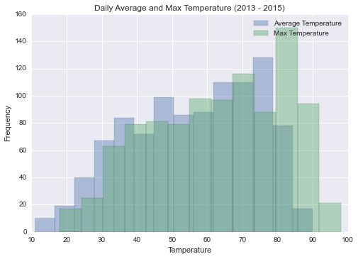


We're getting pretty good at this. Let's try plotting a scatterplot to see the relationship between temperature and precipitation.


```python
sns.plt.scatter(clean_data.mean_temperature, clean_data.precipitation)
sns.plt.title('Temperature vs Precipitation')
sns.plt.xlabel('Temperature')
sns.plt.ylabel('Precipitation')
```
<br>


    <matplotlib.text.Text at 0x107f955c0>


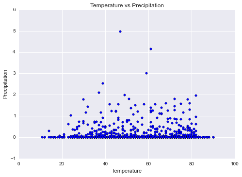


This plot can help us think about the next step of modeling the data; it doesn't seem like temperature by itself will do a great job of predicting the amount of precipitation since there's a range of possible precipitation values for each temperature.

It'd be a hassle to do a scatterplot for every possible variable, but luckily, we can use the built in `pairplot` function. (We're only taking a few columns of the `clean_data` data frame though to keep things managable.)


```python
sns.pairplot(clean_data, vars=["mean_temperature", "precipitation", "dew_point", "wind_speed"])
```
<br>


    <seaborn.axisgrid.PairGrid at 0x107cd3ba8>


In this level, we looked at how to explore our data to make sure nothing's wrong with it and to start thinking about how to model precipitation. But before we go let's save all our hard work. We'll write a new csv file called "clean_weather_data.csv" so that we don't have to worry about weird values for further analyses.

```python
clean_data.to_csv('clean_weather_data.csv', index=False)
```

That's it! Once you're ready, we'll see you on the next level to start modeling the data. 

<a href="#top" class="top" id="level3">Top</a>
# Level 3: Introduction to Modeling

(Find this notebook hosted [here](http://nbviewer.jupyter.org/github/kl2806/devfest-data-science-track/blob/master/level_3.ipynb).)

Now we're at one of the coolest parts of data science: modeling. When you're analyzing data, you usually have something you want to predict based on other information you have. There are many different ways to "do prediction," and we'll be covering two popular methods: *k*-nearest neighbor (KNN) and linear regression. But before we start, let's cover some terminology and concepts that are good to keep in mind when modeling.

We usually call the variable that we're trying to predict the *output variable*; the other features we use to predict said output are called *input variables.* The procedure by which predict a new data point using other data points is our *model*, and as we mentioned before, there are a variety of modeling techniques to choose from. Luckily we don't have to code them all from scratch because Python is awesome: there's a package called `scikit-learn` that does this for us. (As an aside, prediction is called *classification* if the output variable is discrete and *regression* if it is continuous.)

So what goes into building a model? Ideally we'd like it to make smart predictions -- it can *learn* from the data we have to detect underlying patterns and relationships. Maybe we could feed it our entire dataset, but then we wouldn't know how well our model actually works since we've just used up all our data. Could we just "re-use" some of the data to test out this model's predictions? If we did that, our model would make some pretty spot-on predictions. Coincidence? Not quite. If you think about it, we'd probably all do a lot better in school if we could see copies of exams before we actually take them. But life is hard and cheating is bad, so we shouldn't encourage our models to cheat either.  

This means we need to partition out the data: "hide away" a *test set* for future validation, and teach our model using a *training set.* There's no magic formula for divvying them up but usually a 60:40 or 80:20 train/test split tends to work well. In this way, our model will have just enough information to make smart predictions on the new test set that it hasn't seen before. 

To make all this more concrete, let's frame it in terms of our problem. What are we trying to do? We want to predict the precipitation on a given day based on weather data about average temperature, wind speed, etc. collected over roughly 1000 days.

Here's our first method: the *k-nearest neighbor*. The name is informative: the *k*-nearest neighbor algorithm says that for any new point, we should average the output values associated with the *k* closest points to it and call that our predicted value. This picture will give us a better idea as to what that means: 


In this picture, *k* = 3 and we want to predict what that green dot could be. The algorithm first looks at the closest 3 points to the green dot and makes an assumption. It says, "Hey, I'm guessing that points closer to each other will be similar to each other, too." This isn't an outrageous assumption to make, especially since we tend to surround ourselves with people we "click" with -- people with whom we share certain qualities or characteristics. So this clever algorithm figures out that there are 2B's versus 1A in the dot's *3 closest neighbors* and predicts that the green dot will also be B. Cool, huh?

Now, let's use this to actually predict some precipitation! We'll first read in our cleaned up data set from the previous level.


```python
import pandas as pd

data = pd.read_csv('clean_weather_data.csv')
print(data.dtypes)
data[:5]
```
<br>


    Month                 int64
    Day                   int64
    Year                  int64
    Mean Temperature      int64
    Max Temperature       int64
    Min Temperature       int64
    Dew Point             int64
    Average Humidity      int64
    Maximum Humidity      int64
    Minimum Humidity      int64
    Precipitation       float64
    Wind Speed          float64
    Max Wind Speed      float64
    Max Gust Speed      float64
    dtype: object


<div>
<table border="1" class="dataframe">
  <thead>
    <tr style="text-align: right;">
      <th></th>
      <th>Month</th>
      <th>Day</th>
      <th>Year</th>
      <th>Mean Temperature</th>
      <th>Max Temperature</th>
      <th>Min Temperature</th>
      <th>Dew Point</th>
      <th>Average Humidity</th>
      <th>Maximum Humidity</th>
      <th>Minimum Humidity</th>
      <th>Precipitation</th>
      <th>Wind Speed</th>
      <th>Max Wind Speed</th>
      <th>Max Gust Speed</th>
    </tr>
  </thead>
  <tbody>
    <tr>
      <th>0</th>
      <td>1</td>
      <td>1</td>
      <td>2013</td>
      <td>33</td>
      <td>40</td>
      <td>26</td>
      <td>22</td>
      <td>54</td>
      <td>64</td>
      <td>44</td>
      <td>0</td>
      <td>7</td>
      <td>15</td>
      <td>26</td>
    </tr>
    <tr>
      <th>1</th>
      <td>1</td>
      <td>2</td>
      <td>2013</td>
      <td>28</td>
      <td>33</td>
      <td>22</td>
      <td>11</td>
      <td>48</td>
      <td>57</td>
      <td>39</td>
      <td>0</td>
      <td>6</td>
      <td>15</td>
      <td>22</td>
    </tr>
    <tr>
      <th>2</th>
      <td>1</td>
      <td>3</td>
      <td>2013</td>
      <td>28</td>
      <td>32</td>
      <td>24</td>
      <td>14</td>
      <td>56</td>
      <td>68</td>
      <td>43</td>
      <td>0</td>
      <td>5</td>
      <td>13</td>
      <td>20</td>
    </tr>
    <tr>
      <th>3</th>
      <td>1</td>
      <td>4</td>
      <td>2013</td>
      <td>34</td>
      <td>37</td>
      <td>30</td>
      <td>19</td>
      <td>56</td>
      <td>63</td>
      <td>48</td>
      <td>0</td>
      <td>8</td>
      <td>18</td>
      <td>28</td>
    </tr>
    <tr>
      <th>4</th>
      <td>1</td>
      <td>5</td>
      <td>2013</td>
      <td>37</td>
      <td>42</td>
      <td>32</td>
      <td>19</td>
      <td>48</td>
      <td>56</td>
      <td>39</td>
      <td>0</td>
      <td>7</td>
      <td>17</td>
      <td>26</td>
    </tr>
  </tbody>
</table>
</div>


Looks like everything's good with the data -- let's now split it up into training and test sets! Thankfully `scikit-learn` already provides a function to do this. We'll use 80% of the data as training data. It's typical to separate your prediction variable from the rest of the data when modeling, so we'll follow this convention as well.


```python
from sklearn.cross_validation import train_test_split

X = data.drop('Precipitation', axis=1)
y = data.Precipitation
X_train, X_test, y_train, y_test = train_test_split(X, y, test_size=0.2)
```
<br>


Great! Now, let's fit our first model. We'll use *k* = 3.


```python
from sklearn.neighbors import KNeighborsRegressor

knn_model = KNeighborsRegressor(n_neighbors=3)
knn_model.fit(X_train, y_train)
```
<br>


    KNeighborsRegressor(algorithm='auto', leaf_size=30, metric='minkowski',
              metric_params=None, n_jobs=1, n_neighbors=3, p=2,
              weights='uniform')


Yay, fitting a model using `sklearn` is super simple! So how do we know how well our model did? Well, we can define a function (typically called a *loss function* among data nerds) that can take our prediction and true value, and quantify how "correct" we were.

For example, let's say we predicted $\hat{y}$ for a case that had a true value of *y*; one common loss function for regression is the squared error loss, or $(y - \hat{y})^2$. We can then compare $\sum_{i = 1}^{n}{(y_i - \hat{y_i})^2}$ to $\sum_{i = 1}^{n}{(y_i - \bar{y})^2}$ where $n$ is the number of data points we have. All this really means is adding up the loss for each individual data point. The second term is equivalent to predicting the average for every case, and if the first term is significantly less, we did much better than just random guessing. Hopefully we did well...let's find out!


```python
knn_y = knn_model.predict(X_test)

knn_sum_squares = ((knn_y - y_test) ** 2).sum()
mean_sum_squares = ((y_test.mean() - y_test) ** 2).sum()

print("Average loss:", mean_sum_squares)
print("KNN loss:", knn_sum_squares)
print("Variation explained: ", 100 * (1 - knn_sum_squares / mean_sum_squares), "%", sep="")
```
<br>


    Average loss: 29.9691113861
    KNN loss: 27.4045222222
    Variation explained: 8.55744146322%


We call the "variation explained" the coefficient of variation, or $r^2$. This quantity tells us how much variation, or interesting information in your data, your model explains in a meaningful way using the relationship between its input and output variables. You can also use the `score` function to automatically calculate this $r^2$.


```python
print("R^2: ", knn_model.score(X_test, y_test))
```
<br>


    R^2:  0.0855744146322


Cool, we managed to fit and analyze our first model! Let's move on to linear regression.

Let's first think about predicting an output variable with only one input variable. The basic idea of linear regression is that you can aim to fit a straight line through the scatterplot, like so:

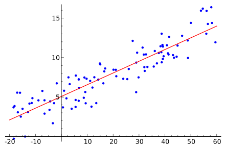

It turns out that you can generalize this to predicting one variable using multiple variables. Let's see how we can put this into code using `sklearn`.


```python
from sklearn.linear_model import LinearRegression
linear_model = LinearRegression()
linear_model.fit(X_train, y_train)
```
<br>


    LinearRegression(copy_X=True, fit_intercept=True, n_jobs=1, normalize=False)


Yup, KNN wasn't a special case, `sklearn` just makes things that easy. Let's see how we do.


```python
print(linear_model.score(X_test, y_test))
```
<br>


    0.210857982665


As it turns out, linear regression did better than the KNN algorithm. One of the key ideas in data science is that you have to explore which models are best to use with your data. For fun, let's see how the two models compare by plotting the true value and the predicted value.


```python
%matplotlib inline
import seaborn as sns
from matplotlib import pyplot as plt

sns.plt.scatter(y_test, knn_model.predict(X_test))
sns.plt.title('KNN Prediction Analysis')
sns.plt.xlabel('Real Value')
sns.plt.ylabel('Prediction')
plt.show()

sns.plt.scatter(y_test, linear_model.predict(X_test))
sns.plt.title('Linear Regression Prediction Analysis')
sns.plt.xlabel('Real Value')
sns.plt.ylabel('Prediction')
plt.show()
```
<br>


    /usr/local/lib/python3.5/site-packages/matplotlib/__init__.py:872: UserWarning: axes.color_cycle is deprecated and replaced with axes.prop_cycle; please use the latter.
      warnings.warn(self.msg_depr % (key, alt_key))


<a href="#top" class="top" id="level4">Top</a>
# Level 4: Advanced Modeling

(Find this notebook hosted [here](http://nbviewer.jupyter.org/github/kl2806/devfest-data-science-track/blob/master/level_4.ipynb).)

In the last section we used Linear Models and K-Nearest Neighbors to predict the amount of rainfall, so now let's spice things up a bit with more advanced modeling techniques. In this level we'll explore ways to transform our data, as well as some machine learning tools that can help our predictive performance. 

First we start by loading our data from the csv file into a pandas dataframe.


```python
import pandas as pd

df = pd.read_csv("clean_weather_data.csv")
df.head()
```
<br>


<div>
<table border="1" class="dataframe">
  <thead>
    <tr style="text-align: right;">
      <th></th>
      <th>Month</th>
      <th>Day</th>
      <th>Year</th>
      <th>Mean Temperature</th>
      <th>Max Temperature</th>
      <th>Min Temperature</th>
      <th>Dew Point</th>
      <th>Average Humidity</th>
      <th>Maximum Humidity</th>
      <th>Minimum Humidity</th>
      <th>Precipitation</th>
      <th>Wind Speed</th>
      <th>Max Wind Speed</th>
      <th>Max Gust Speed</th>
    </tr>
  </thead>
  <tbody>
    <tr>
      <th>0</th>
      <td>1</td>
      <td>1</td>
      <td>2013</td>
      <td>33</td>
      <td>40</td>
      <td>26</td>
      <td>22</td>
      <td>54</td>
      <td>64</td>
      <td>44</td>
      <td>0</td>
      <td>7</td>
      <td>15</td>
      <td>26</td>
    </tr>
    <tr>
      <th>1</th>
      <td>1</td>
      <td>2</td>
      <td>2013</td>
      <td>28</td>
      <td>33</td>
      <td>22</td>
      <td>11</td>
      <td>48</td>
      <td>57</td>
      <td>39</td>
      <td>0</td>
      <td>6</td>
      <td>15</td>
      <td>22</td>
    </tr>
    <tr>
      <th>2</th>
      <td>1</td>
      <td>3</td>
      <td>2013</td>
      <td>28</td>
      <td>32</td>
      <td>24</td>
      <td>14</td>
      <td>56</td>
      <td>68</td>
      <td>43</td>
      <td>0</td>
      <td>5</td>
      <td>13</td>
      <td>20</td>
    </tr>
    <tr>
      <th>3</th>
      <td>1</td>
      <td>4</td>
      <td>2013</td>
      <td>34</td>
      <td>37</td>
      <td>30</td>
      <td>19</td>
      <td>56</td>
      <td>63</td>
      <td>48</td>
      <td>0</td>
      <td>8</td>
      <td>18</td>
      <td>28</td>
    </tr>
    <tr>
      <th>4</th>
      <td>1</td>
      <td>5</td>
      <td>2013</td>
      <td>37</td>
      <td>42</td>
      <td>32</td>
      <td>19</td>
      <td>48</td>
      <td>56</td>
      <td>39</td>
      <td>0</td>
      <td>7</td>
      <td>17</td>
      <td>26</td>
    </tr>
  </tbody>
</table>
</div>


To predict whether or not it'll rain on a given day, let's come up with an easy way to denote "rain" or "no rain." Since we're lazy and don't want to write real words when we don't have to, we can turn our Precipitation level data into 0's for days without rain and 1's for days with rain. This is accomplished with the following code:


```python
import numpy as np

y = np.array(df["Precipitation"] != 0, dtype=int)
data = df.drop('Precipitation',axis=1)
```
<br>


Wait...so far, we haven't been using day or month data. We could potentially be missing out on some powerful features: maybe there's truth to "April showers bring May flowers." The problem is that month and day are categorical variables, so we can't just use the current encoding. What we have to do is add a new dimension for each possible day and month and zero out all dimensions except for the ones corrsponding to the appropriate month and day. 

So for example, on January 1st, both the January column and the 1st day of the month column will be set to 1. This is called one of k encoding or one hot encoding. We can use sklearn to easily transform our data. First we isolate the Day and Month columns and do one hot encoding using the OneHotEncoder class in the preprocessing module of sklearn.


```python
from sklearn.preprocessing import OneHotEncoder

one_hot = OneHotEncoder()
new_day = one_hot.fit_transform(data[["Month","Day"]]).toarray()
```
<br>


Here, ```fit_transform``` does all the work of figuring out what the possible categories are and assigning dimensions to them. Let's take a look to see what's happening. If we look at the first row of the resulting array we should see a 1 in the January column and a 1 on the first day of the month column.


```python
new_day[0, :]
```
<br>


    array([ 1.,  0.,  0.,  0.,  0.,  0.,  0.,  0.,  0.,  0.,  0.,  0.,  1.,
            0.,  0.,  0.,  0.,  0.,  0.,  0.,  0.,  0.,  0.,  0.,  0.,  0.,
            0.,  0.,  0.,  0.,  0.,  0.,  0.,  0.,  0.,  0.,  0.,  0.,  0.,
            0.,  0.,  0.,  0.])


Now we can combine the one hot encoded features with our original data and split into train and test data.


```python
X = np.hstack([new_day, data.values[:, 2:]])
```
<br>


```python
from sklearn.cross_validation import train_test_split

X_train, X_test, y_train, y_test = train_test_split(X, y, test_size=0.2)
```
<br>


Now onto some machine learning techniques. A popular classification algorithm is the Support Vector Machine or SVM. Basically what the SVM does is described in the below image.


Source: http://www.improvedoutcomes.com/docs/WebSiteDocs/Introduction/Tutorials/Tutorial_9_Support_Vector_Machines/Tutorial_9__Introduction.htm

The goal of the SVM is to make a line which separates the two classes (red and green) as best as possible. The intuition is that the "best" way to separate the classes is to make a line which is as close to being in between both classes as possible. 

In the above image, panels A, B, and C aren't such good separating lines because they just barely don't touch a member of one of the classes. These kinds of boundaries feel unwieldy, and probably wouldn't work well if we added more data into the mix. Panel D shows the "maximum margin" solution of the SVM, which makes a line which is equidistant from each class -- there's a lot of wiggle room. The SVM generalizes to any number of dimensions, so we can use it with our data to predict whether it will rain on a particular day. For this we use sklearn's SVC class. Sklearn is designed to work fairly simply, so all we have to do is call the ```fit()``` and ```predict()``` methods of the SVC class and we have a working SVM! Let's fit an SVM on our training set and test it on our test data.


```python
from sklearn.svm import SVC
svm = SVC()
svm.fit(X_train, y_train)
svm.score(X_test, y_test)
```
<br>


    0.85643564356435642


That's not bad accuracy given that we're predicting the weather, but maybe we can do better! When the SVM is finding the maximum margin line, it allows itself to make errors and misclassify training data. This is because we want the boundary to be generalizable to other datasets, not just the one we currently have. We, as the data scientists, assign a cost to these misclassifications, and the cost is called a hyperparameter. 

But what cost parameter do we choose? We can't just pick *any* number -- we want the *best possible* cost parameter that will make our model as smart as it can be. We also want the optimal cost obtained from several different training sets so that our model will be prepared for any type of data we throw at it later. Recall our previous train-test split, where we hid away a portion of the data and trained the model on the remaining set. We could try that again here, but our model might get too comfortable with that one test set and figure out a clever cost parameter that works really well for that specific dataset only. We need to make sure it doesn't get lazy and train it as hard as possible. So what should we do?

Let's try breaking up our training data into K sections called "folds." At each iteration we hide one fold and train the SVM on the remaining K-1 folds, trying out several possible costs for the SVM. For each cost we quantify the model's performance by taking the average test error over all folds, then pick the cost parameter with the lowest overall test error. This is called K-Fold Cross Validation. Since pictures always make more sense than words, an example (for K = 7) is shown below.


Source: https://powerofmlexperience.wordpress.com/2015/07/15/k-fold-cross-validation-made-simple/

Say we are trying to approximate the test error for a cost of 1, using 7-fold cross validation. We would go through each array in the above image, train on the green portion and obtain the error on the gray portion. The averaged errors over the seven folds is the performance of setting the model's cost equal to 1. It's a bit complex, but thankfully sklearn takes care of almost everything for us with its ```grid_search``` module. We can use it (and plot the errors for different costs) as follows: we define the parameters that we want to sweep through (in this case cost) and then we get all of the errors.


```python
from sklearn.grid_search import GridSearchCV

parameters = {"kernel": ["linear"], 
              'C': [10 ** i for i in range(-5, 2)]}
search = GridSearchCV(SVC(), param_grid=parameters, refit=True, cv=5)
search.fit(X_train, y_train)
```
<br>


```
    GridSearchCV(cv=5, error_score='raise',
           estimator=SVC(C=1.0, cache_size=200, class_weight=None, coef0=0.0,
      decision_function_shape=None, degree=3, gamma='auto', kernel='rbf',
      max_iter=-1, probability=False, random_state=None, shrinking=True,
      tol=0.001, verbose=False),
           fit_params={}, iid=True, n_jobs=1,
           param_grid={'kernel': ['linear'], 'C': [1e-05, 0.0001, 0.001, 0.01, 0.1, 1, 10]},
           pre_dispatch='2*n_jobs', refit=True, scoring=None, verbose=0)
```
<br>


```python
#plot the validation error

import matplotlib.pyplot as plt
import seaborn as sns
%matplotlib inline

errs = [1 - score[1] for score in search.grid_scores_]
cs = parameters["C"]
plt.plot(cs,errs)
plt.semilogx()
plt.xlabel("Cost")
plt.ylabel("Validation Error")
plt.title("Linear SVM 5-Fold Cross Validation Error")
```
<br>


    /usr/local/lib/python3.5/site-packages/matplotlib/__init__.py:872: UserWarning: axes.color_cycle is deprecated and replaced with axes.prop_cycle; please use the latter.
      warnings.warn(self.msg_depr % (key, alt_key))


    <matplotlib.text.Text at 0x10dcbe0f0>


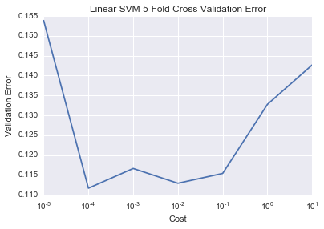


We can check what the best parameters are like this.


```python
search.best_params_
```
<br>


    {'C': 0.0001, 'kernel': 'linear'}


The cool thing about sklearn is that the ```GridSearchCV``` class keeps the best SVM that it found, and then we can use it simply by using ```predict()``` and ```score()``` like before.


```python
search.score(X_test, y_test)
```
<br>


    0.86633663366336633


That's even better accuracy, but what if a straight line isn't even a good way to divide the two classes? What if the line is curved or wiggly? We can add this "wigglyness" to the SVM by using kernels. Basically a kernel maps our data to a higher dimension, and then the SVM finds a linear separation of the data in that higher dimension. When the data is mapped back to our (lower) dimension, the SVM's line in the higher dimension turns out to be curved. Don't believe me? Take a look at the video below to see an illustrative example. 


[](http://www.youtube.com/watch?v=3liCbRZPrZA)

For this tutorial we'll be using the Radial Basis Function or RBF kernel. It's a little bit different than the kernel above because it maps to infinite dimensions, but that's for another time. 

When training an RBF kernel SVM, there are two hyperparameters: one is the cost, which we've dealt with before, and the other is "gamma." Gamma controls how wiggly the line can be. But this isn't a problem -- we can just use K-Fold Cross Validation as last time, and consider pairs of costs and gammas. The code to do this is almost exactly the same as before, since we just add another parameter to sweep over.


```python
params = {"kernel":["rbf"], 
          "C":[10**i for i in np.arange(-1, 3, .5)],
          "gamma":[10**i for i in np.arange(-10, 0)]}
              
search = GridSearchCV(SVC(), param_grid=params, refit=True, cv=5)
search.fit(X_train,y_train)
```
<br>


```
    GridSearchCV(cv=5, error_score='raise',
           estimator=SVC(C=1.0, cache_size=200, class_weight=None, coef0=0.0,
      decision_function_shape=None, degree=3, gamma='auto', kernel='rbf',
      max_iter=-1, probability=False, random_state=None, shrinking=True,
      tol=0.001, verbose=False),
           fit_params={}, iid=True, n_jobs=1,
           param_grid={'kernel': ['rbf'], 'C': [0.10000000000000001, 0.31622776601683794, 1.0, 3.1622776601683795, 10.0, 31.622776601683793, 100.0, 316.22776601683796], 'gamma': [1e-10, 1.0000000000000001e-09, 1e-08, 9.9999999999999995e-08, 9.9999999999999995e-07, 1.0000000000000001e-05, 0.0001, 0.001, 0.01, 0.10000000000000001]},
           pre_dispatch='2*n_jobs', refit=True, scoring=None, verbose=0)
```
<br>


```python
#plot errors
errs = [1 - score[1] for score in search.grid_scores_]

errs = np.array(errs).reshape(len(params["C"]), len(params["gamma"]))
plt.imshow(errs,cmap="winter")
plt.xlabel('Gamma')
plt.ylabel('C')
plt.title("RBF SVM 5-Fold Cross Validation Error")
plt.colorbar()
plt.xticks(np.arange(len(params["gamma"])), params["gamma"], rotation=45)
plt.yticks(np.arange(len(params["C"])),params["C"])
```
<br>


```
    ([<matplotlib.axis.YTick at 0x10e630048>,
      <matplotlib.axis.YTick at 0x10e620208>,
      <matplotlib.axis.YTick at 0x10e62c7f0>,
      <matplotlib.axis.YTick at 0x10ddb49e8>,
      <matplotlib.axis.YTick at 0x10e2ffba8>,
      <matplotlib.axis.YTick at 0x10dceb4a8>,
      <matplotlib.axis.YTick at 0x10de3bf98>,
      <matplotlib.axis.YTick at 0x10b24fcc0>],
     <a list of 8 Text yticklabel objects>)
```


Again we can check what the best parameters were, and see how our performance on the test set is:


```python
print(search.best_params_)
print(search.score(X_test, y_test))
```
<br>


```
    {'C': 1.0, 'gamma': 0.0001, 'kernel': 'rbf'}
    0.856435643564
```

We get a similar performance with the normal (linear) SVM and the RBF SVM, but that won't always be the case. Now you can go explore other kernels and try them out!

<a href="#top" class="top" id="level5">Top</a>
# Level 5: Interactive Visualizations

(Find this notebook hosted [here](http://nbviewer.jupyter.org/github/kl2806/devfest-data-science-track/blob/master/level_5.ipynb).)

Welcome to the last level of this data science tutorial! So far, we have gathered, explored, and modeled weather data. However, one key part is left: visualizing and interacting with data. In this level, we will generate interactive visualizations using the `bokeh` module in Python. The best part of `bokeh` is that we can integrate it easily with web apps that are powered by Python.

First, let's import our data from previous levels.


```python
import numpy as np
import pandas as pd

data = pd.read_csv('clean_weather_data.csv')
print(data.dtypes)
data[:5]
```
<br>


```
    index                 int64
    month                 int64
    day                   int64
    year                  int64
    mean_temperature      int64
    max_temperature       int64
    min_temperature       int64
    dew_point             int64
    average_humidity      int64
    maximum_humidity      int64
    minimum_humidity      int64
    precipitation       float64
    wind_speed          float64
    max_wind_speed      float64
    max_gust_speed      float64
    dtype: object
```


<div>
<table border="1" class="dataframe">
  <thead>
    <tr style="text-align: right;">
      <th></th>
      <th>index</th>
      <th>month</th>
      <th>day</th>
      <th>year</th>
      <th>mean_temperature</th>
      <th>max_temperature</th>
      <th>min_temperature</th>
      <th>dew_point</th>
      <th>average_humidity</th>
      <th>maximum_humidity</th>
      <th>minimum_humidity</th>
      <th>precipitation</th>
      <th>wind_speed</th>
      <th>max_wind_speed</th>
      <th>max_gust_speed</th>
    </tr>
  </thead>
  <tbody>
    <tr>
      <th>0</th>
      <td>0</td>
      <td>1</td>
      <td>1</td>
      <td>2013</td>
      <td>33</td>
      <td>40</td>
      <td>26</td>
      <td>22</td>
      <td>54</td>
      <td>64</td>
      <td>44</td>
      <td>0</td>
      <td>7</td>
      <td>15</td>
      <td>26</td>
    </tr>
    <tr>
      <th>1</th>
      <td>1</td>
      <td>1</td>
      <td>2</td>
      <td>2013</td>
      <td>28</td>
      <td>33</td>
      <td>22</td>
      <td>11</td>
      <td>48</td>
      <td>57</td>
      <td>39</td>
      <td>0</td>
      <td>6</td>
      <td>15</td>
      <td>22</td>
    </tr>
    <tr>
      <th>2</th>
      <td>2</td>
      <td>1</td>
      <td>3</td>
      <td>2013</td>
      <td>28</td>
      <td>32</td>
      <td>24</td>
      <td>14</td>
      <td>56</td>
      <td>68</td>
      <td>43</td>
      <td>0</td>
      <td>5</td>
      <td>13</td>
      <td>20</td>
    </tr>
    <tr>
      <th>3</th>
      <td>3</td>
      <td>1</td>
      <td>4</td>
      <td>2013</td>
      <td>34</td>
      <td>37</td>
      <td>30</td>
      <td>19</td>
      <td>56</td>
      <td>63</td>
      <td>48</td>
      <td>0</td>
      <td>8</td>
      <td>18</td>
      <td>28</td>
    </tr>
    <tr>
      <th>4</th>
      <td>4</td>
      <td>1</td>
      <td>5</td>
      <td>2013</td>
      <td>37</td>
      <td>42</td>
      <td>32</td>
      <td>19</td>
      <td>48</td>
      <td>56</td>
      <td>39</td>
      <td>0</td>
      <td>7</td>
      <td>17</td>
      <td>26</td>
    </tr>
  </tbody>
</table>
</div>


Cool, let's start using `bokeh`.


```python
import bokeh.io, bokeh.plotting, bokeh.models
bokeh.io.output_notebook()
```
<br>


The above code gets the necessary modules loaded and tells `bokeh` that we want output directly in the notebook. (Feel free to ignore that line if not running as a notebook.)

Now, let's get a basic plot set up with `bokeh`.


```python
p = bokeh.plotting.figure()
p.circle(data.mean_temperature, data.dew_point)
bokeh.plotting.show(p)
```
<br>


```
    <bokeh.io._CommsHandle at 0x10b38ea58>
```


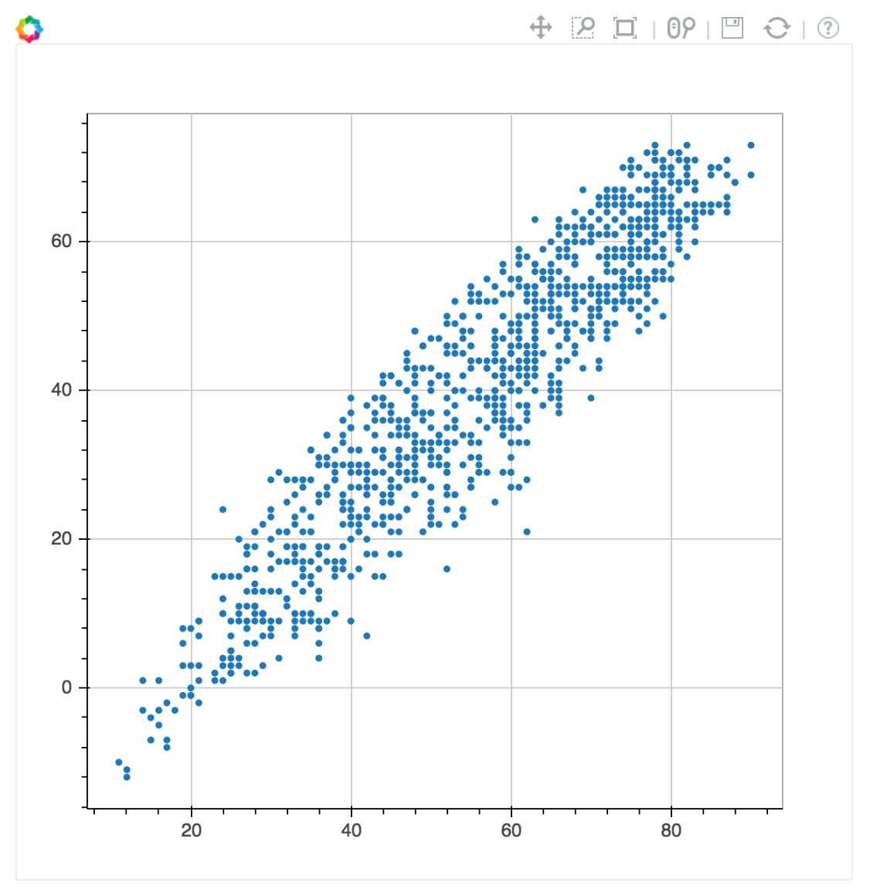

What an interesting interactive plot! Let's add some titles and axis labels.


```python
q = bokeh.plotting.figure()
q.circle(data.mean_temperature, data.dew_point)
q.title = 'My Interactive Visualization'
q.xaxis.axis_label = 'Average Temperature'
q.yaxis.axis_label = 'Dew Point'
bokeh.plotting.show(q)
```
<br>


```
    <bokeh.io._CommsHandle at 0x10b397c18>
```


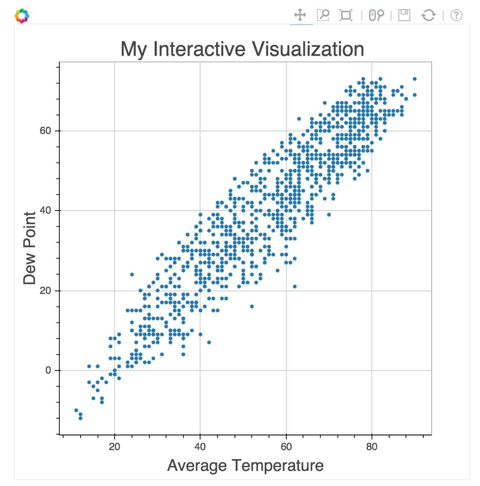

The great thing about `bokeh` is that most of the interactive functionality comes out of the box; all you have to do is specify the kind of plot that you want. Now, let's try a histogram.


```python
hist_plot = bokeh.plotting.figure(title = 'Histogram of Average Temperature')
hist, edges = np.histogram(data.mean_temperature, bins = 25)
hist_plot.quad(top = hist, bottom = 0, left = edges[:-1], right = edges[1:], line_color = "#000000")
hist_plot.xaxis.axis_label = "Average Temperature"
hist_plot.yaxis.axis_label = "Frequency"
bokeh.plotting.show(hist_plot)
```
<br>


    <bokeh.io._CommsHandle at 0x10b3adc88>


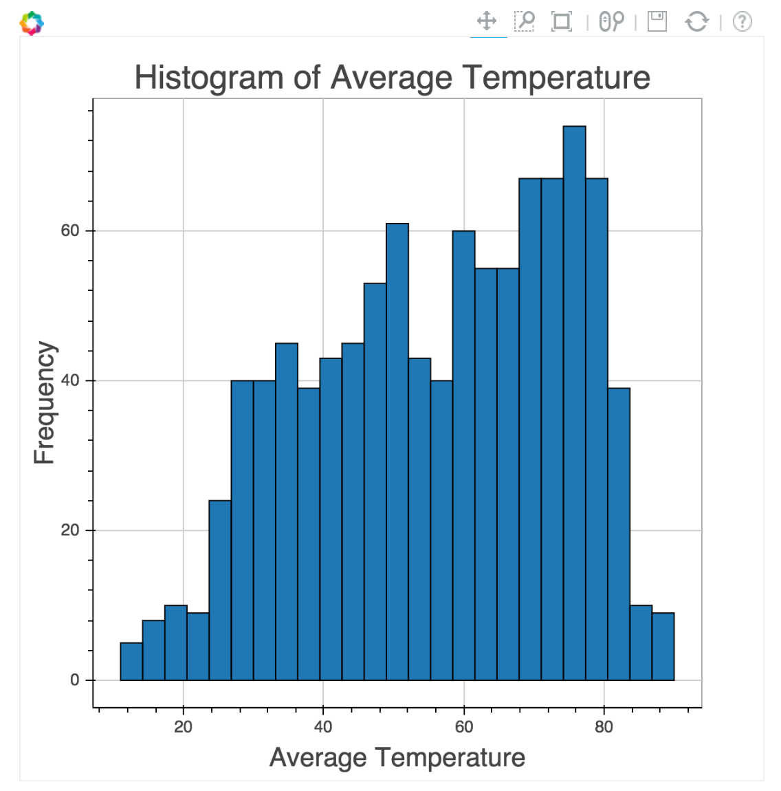

To compare with our previous plotting tool, Seaborn, it takes a little bit more work to get `bokeh` plots together, but the upside is that we get interactivity for free, letting us explore which parts of the plot are most interesting to us. Another interesting bit of functionality is the ability to "tab" your plots, let's check it out.


```python
line_data = np.linspace(data.mean_temperature.min(), data.mean_temperature.max())

first = bokeh.plotting.figure()
first.circle(data.mean_temperature, data.max_temperature)
first.line(line_data, line_data)
tab1 = bokeh.models.Panel(child = first, title = 'First Plot')

second = bokeh.plotting.figure()
second.circle(data.mean_temperature, data.min_temperature)
second.line(line_data, line_data)
tab2 = bokeh.models.Panel(child = second, title = 'Second Plot')

tabs = bokeh.models.Tabs(tabs = [tab1, tab2])
bokeh.plotting.show(tabs)
```
<br>


    <bokeh.io._CommsHandle at 0x10b3de7b8>


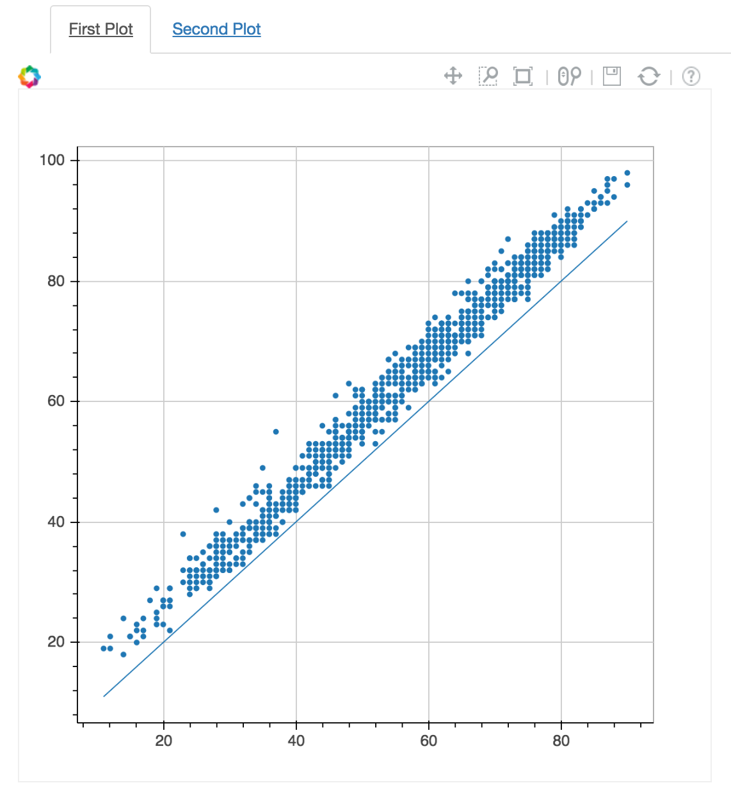

Another cool aspect of `bokeh` is the ability to include widgets. Let's use a widget to interactively change the size of the points in our scatterplot.

Instead of specifying the data directly, we'll use the name of the column in a data source we create.


```python
start_value = 5
point_size = [start_value for i in range(len(data))]

source = bokeh.models.ColumnDataSource(data = dict(x = data.mean_temperature, y = data.dew_point, s = point_size))

plot = bokeh.plotting.figure()
plot.circle('x', 'y', size = 's', source = source)

callback = bokeh.models.CustomJS(args = dict(source = source), code="""
        var data = source.get('data');
        var size = cb_obj.get('value');
        x = data['x'];
        y = data['y'];
        s = data['s'];
        for (i = 0; i < x.length; i++) {
            s[i] = size;
        }
        source.trigger('change');
    """)

size = bokeh.models.Slider(start = 1, end = 10, value = start_value, step = .05, title = "Size", callback = callback)

layout = bokeh.io.vform(size, plot)

bokeh.plotting.show(layout)
```
<br>


    <bokeh.io._CommsHandle at 0x109bdc5f8>


We can leverage the above functionality to create cool interactions with our users.

One last flashy bit of `bokeh` is the tool tip option, which allows us to display more information about the point when someone hovers over the point. Let's try using it on our scatterplot.


```python
from bokeh.plotting import figure, output_file, show, ColumnDataSource
from bokeh.models import HoverTool

tooltip_source = bokeh.plotting.ColumnDataSource(data = dict(x = data.mean_temperature, y = data.dew_point,\
                                                             month = data.month, day = data.day, year = data.year))

hover = bokeh.models.HoverTool(
        tooltips = [
            ("Date", "@month-@day-@year"),
            ("Average Temperature", "@x"),
            ("Dew Point", "@y")
        ]
    )

fig = figure(tools = [hover], title = "Hover over the dots!")

fig.circle('x', 'y', source = tooltip_source)

show(fig)
```
<br>


    <bokeh.io._CommsHandle at 0x10c067940>


Awesome, we created a nice plot that shows us useful information when we hover over it.

Thanks for completing this curriculum and taking your first steps towards being a data scientist!
